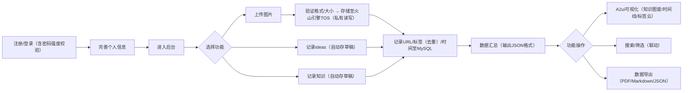
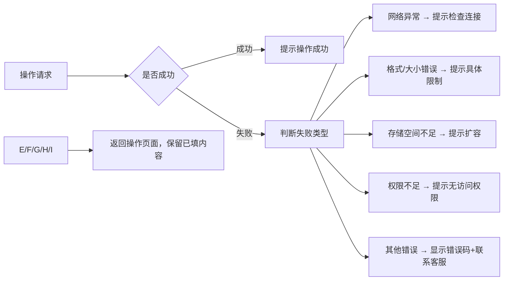

# 个人数据管理后台PRD文档（优化版）
**版本**：v1.1  
**编写人**：需求挖掘专家  
**日期**：2025-12-25  
## 目录
1. [文档概述](#文档概述)
2. [产品背景和目标](#产品背景和目标)
3. [功能清单](#功能清单)
4. [用户故事](#用户故事)
5. [功能流程图](#功能流程图)
6. [页面说明、交互细节](#页面说明交互细节)
7. [数据埋点](#数据埋点)
8. [验收标准](#验收标准)
9. [非功能性需求](#非功能性需求)
10. [依赖与约束](#依赖与约束)
11. [风险与应对](#风险与应对)
12. [附录](#附录)

## 1. 文档概述
### 1.1 项目简介
本项目是一个Web端个人数据管理后台，旨在帮助有进取心的年轻人有效管理个人数据（图片/ideas/知识），通过A2ui可视化呈现个人数据，打造个人专属的AI大脑。
### 1.2 修订记录
| 版本 | 日期 | 修改内容 | 作者 |
|------|------|----------|------|
| v1.0 | 2025-12-24 | 初始版本 | 需求挖掘专家 |
| v1.1 | 2025-12-25 | 补充功能依赖、边缘场景、交互细节、技术规范等优化内容 | 需求挖掘专家 |

## 2. 产品背景和目标
### 2.1 市场痛点
- 用户数据所有权缺失：现有工具平台掌握用户数据所有权，用户无法完全掌控个人信息
- 个人数据库意识薄弱：大部分用户缺乏建设个人数据库的意识，数据分散难以整合
- 数据安全隐患：用户担心个人数据泄露或被平台滥用
### 2.2 目标用户
- **用户画像**：18-35岁有进取心的年轻人，注重个人成长和数据安全，熟悉互联网产品使用
- **行为习惯**：喜欢尝试新事物，注重个人隐私，愿意为提升效率和安全的产品付费
### 2.3 核心价值
帮助用户有效管理个人数据，通过A2ui可视化呈现个人数据，打造个人专属的AI大脑，让用户真正拥有自己的数据所有权。
### 2.4 业务目标
- **首月**：注册用户5000-10000，DAU 1000-2000，7日留存25%-35%
- **3个月**：注册用户5-10万，DAU 5000-10000，30日留存20%-30%
- **6个月**：注册用户20-50万，DAU 2-5万，付费转化率5%-10%
### 2.5 项目范围
- **本次开发**：Web端个人数据管理后台核心功能
- **本次不做**：移动端APP开发、第三方登录、团队协作功能

## 3. 功能清单
### 3.1 按优先级+依赖关系排序
| 优先级 | 功能名称 | 功能描述 | 依赖功能 | 状态 |
|--------|----------|----------|----------|------|
| Must | 用户注册/登录 | 支持邮箱和手机号注册登录，包含验证码验证 | - | 待开发 |
| Must | 个人信息完善 | 用户完善昵称、简介、职业等基本信息 | 用户注册/登录 | 待开发 |
| Must | 图片上传与标签管理 | 支持图片上传至火山引擎TOS，设置/修改/删除图片标签（去重逻辑：同一图片标签不重复），记录URL/标签/时间至MySQL | 个人信息完善 | 待开发 |
| Must | ideas管理 | 支持MD格式编辑/查看/删除ideas，自动保存草稿（每30秒/次，最多保留10条，有效期7天），写入MySQL数据库 | 个人信息完善 | 待开发 |
| Must | 知识管理 | 支持MD格式编辑/查看/删除知识，自动保存草稿（规则同ideas管理），写入MySQL数据库 | 个人信息完善 | 待开发 |
| Must | 数据汇总展示 | 后台展示MySQL数据库中所有数据的汇总信息（输出格式：JSON结构，包含数据类型/数量/时间分布） | 图片上传与标签管理、ideas管理、知识管理 | 待开发 |
| Should | A2ui数据可视化 | 通过AI驱动的可视化界面（知识图谱/时间线/标签云）呈现个人数据，依赖数据汇总展示的JSON输出格式 | 数据汇总展示 | 待开发 |
| Should | 数据筛选 | 支持按分类、标签、时间筛选数据，筛选结果支持二次搜索 | 数据汇总展示 | 待开发 |
| Should | 搜索功能 | 支持按关键词搜索（范围：标题+标签+内容摘要），搜索结果支持二次筛选 | 数据汇总展示 | 待开发 |
| Could | 数据导出 | 支持将数据导出为PDF/Markdown/JSON格式（图片：PDF嵌入Base64，Markdown/JSON存储TOS签名URL，有效期7天） | 数据汇总展示 | 待开发 |
| Could | AI辅助整理 | 自动生成图片标签、内容摘要等 | 图片上传与标签管理、ideas管理、知识管理 | 待开发 |

### 3.2 功能分类
#### 用户端功能
- 注册/登录模块
- 个人信息管理
- 图片管理（上传、标签（增删改查）、查看）
- ideas管理（编辑、查看、删除、草稿自动保存）
- 知识管理（编辑、查看、删除、草稿自动保存）
- 数据汇总与可视化
- 搜索与筛选（支持联动）
#### 管理后台功能
- 用户管理
- 数据统计
- 系统设置

## 4. 用户故事
### 4.1 主流程用户故事
1. **作为**新用户，**我希望**通过邮箱或手机号注册账号（含密码强度提示），**以便**开始使用个人数据管理后台。
2. **作为**已注册用户，**我希望**完善个人信息（昵称、简介、职业），**以便**建立个人数据档案。
3. **作为**普通用户，**我希望**上传图片并设置/修改/删除标签（避免重复），**以便**分类管理个人图片数据。
4. **作为**普通用户，**我希望**用MD格式记录ideas（支持自动保存草稿），**以便**清晰整理灵感和想法。
5. **作为**普通用户，**我希望**用MD格式记录学习到的知识（支持自动保存草稿），**以便**沉淀个人知识体系。
6. **作为**普通用户，**我希望**在后台查看所有数据的汇总信息，**以便**全面了解个人数据情况。
7. **作为**普通用户，**我希望**通过A2ui可视化（知识图谱/时间线/标签云）呈现个人数据，**以便**直观感受个人数据价值。
8. **作为**普通用户，**我希望**按关键词搜索+多条件筛选数据，**以便**快速找到目标内容。
9. **作为**普通用户，**我希望**将数据导出为指定格式（PDF/Markdown/JSON），**以便**离线备份或跨平台使用。

### 4.2 异常场景用户故事
1. **作为**用户，**我希望**在网络失败时收到明确提示（如“网络异常，请检查连接后重试”），**以便**知道操作未成功。
2. **作为**用户，**我希望**在权限不足时无法访问敏感功能，**以便**保障数据安全。
3. **作为**用户，**我希望**在图片上传失败时收到详细错误信息（如“文件格式不支持”“文件超过10MB”“存储空间不足”），**以便**及时处理问题。
4. **作为**用户，**我希望**删除数据时收到二次确认提示（“删除后不可恢复，是否确认？”），**以便**避免误操作。
5. **作为**用户，**我希望**账号异地登录时收到安全提醒（如短信/邮箱通知），**以便**保障账号安全。
6. **作为**用户，**我希望**存储空间不足时收到扩容提示，**以便**继续上传数据。

## 5. 功能流程图
### 5.1 主流程

### 5.2 异常流程

## 6. 页面说明、交互细节
### 6.1 注册页面
- **字段说明**：
  - 邮箱/手机号：必填，格式验证（手机号正则：^1[3-9]\d{9}$；邮箱正则：^[a-zA-Z0-9_-]+@[a-zA-Z0-9_-]+(\.[a-zA-Z0-9_-]+)+$）
  - 验证码：必填，6位数字，有效时长5分钟
  - 密码：必填，8-20位，包含字母+数字，支持密码可见性切换（眼睛图标）
- **交互细节**：
  - 输入密码实时显示强度提示（弱：仅字母/数字；中：字母+数字；强：字母+数字+特殊符号）
  - 点击“获取验证码”按钮后，按钮变为不可点击状态，倒计时60秒，倒计时结束后恢复可点击
  - 输入错误时，对应字段下方显示红色错误提示（如“手机号格式错误”“密码强度不足”）
  - 注册成功后自动跳转到完善个人信息页面，若30分钟内未完善，下次登录强制跳转

### 6.2 个人信息完善页面
- **字段说明**：
  - 昵称：必填，2-10个字符，支持中文/字母/数字，不允许特殊符号
  - 简介：可选，0-200个字符，支持换行
  - 职业：可选，0-50个字符，支持中文/字母/数字
- **交互细节**：
  - 点击“保存”按钮后，显示加载动画（持续时间≤1秒），保存成功后跳转到后台首页
  - 若昵称重复，提示“该昵称已被使用，请更换”
  - 支持“暂不完善”按钮，点击后跳转到后台首页，但顶部显示悬浮提示（“请尽快完善个人信息，提升使用体验”），3天内每次登录显示

### 6.3 图片上传页面
- **字段说明**：
  - 图片文件：必填，支持JPG/PNG/WebP格式，单张大小不超过10MB，单次最多上传5张
  - 标签：必填，1-5个标签，用逗号分隔，自动去重（输入重复标签时实时提示“该标签已存在”）
- **交互细节**：
  - 支持拖拽上传+点击上传两种方式，拖拽区域显示虚线边框+提示文字
  - 上传过程中显示进度条（精确到1%），支持单个文件取消上传
  - 大文件（≥5MB）上传中断后支持断点续传（基于火山引擎TOS分片上传功能）
  - 上传成功后显示图片预览（尺寸：200x200px，点击预览原图）和标签信息，支持标签编辑（增删改）
  - 存储空间不足时，页面顶部显示红色提示条（“当前存储空间已用尽，可升级套餐扩容”），并屏蔽上传按钮

### 6.4 MD编辑页面（ideas/知识通用）
- **字段说明**：
  - 标题：必填，2-50个字符，支持中文/字母/数字/特殊符号
  - 内容：必填，MD格式文本，支持代码块/表格/图片插入（图片支持上传至TOS后自动插入URL）
- **交互细节**：
  - 支持实时预览功能（左右分栏：编辑区+预览区），预览区同步更新延迟≤500ms
  - 提供常用MD格式快捷按钮（加粗、斜体、列表、标题、链接、图片上传），悬浮显示功能说明
  - 自动保存草稿：每30秒自动保存一次，草稿列表显示在页面右侧（最多10条，按时间倒序排列，显示保存时间），支持草稿恢复/删除
  - 编辑过程中关闭页面/刷新，弹出确认提示（“当前内容已自动保存，是否离开？”）
  - 点击“提交”按钮后，校验标题非空，提交成功后跳转到数据汇总页面，草稿自动清除

### 6.5 数据汇总页面
- **字段说明**：
  - 数据统计卡片：显示图片（数量+占用空间）、ideas（数量+总字数）、知识（数量+总字数）的统计信息，支持点击卡片跳转到对应分类页面
  - 数据列表：按时间倒序显示所有数据（默认10条/页，支持自定义10/20/50条/页），每条数据显示标题、类型、标签、创建时间、预览缩略图
- **交互细节**：
  - 支持按分类（图片/ideas/知识）筛选，筛选后统计卡片同步更新数据
  - 支持按标签筛选（下拉选择已创建标签，支持多选），按时间筛选（日期范围选择器）
  - 搜索框支持关键词输入，实时联想匹配（匹配标题+标签），搜索结果高亮关键词
  - 点击数据条目可查看详情（弹窗形式，支持编辑/删除操作）
  - 删除数据时弹出二次确认提示（“删除后不可恢复，是否确认？”），确认后异步删除，页面无刷新更新数据列表
  - 分页控件显示当前页码、总页数、总条数，支持首页/尾页/上一页/下一页快速跳转

## 7. 数据埋点
### 7.1 关键行为埋点
1. **注册成功**：记录注册方式（邮箱/手机号）、注册时间、密码强度
2. **个人信息完善**：记录完善完成时间、是否填写简介/职业
3. **图片上传**：记录上传时间、图片大小、标签数量、上传方式（拖拽/点击）、是否断点续传、上传成功率
4. **ideas创建**：记录创建时间、内容长度、是否使用草稿恢复、保存草稿次数
5. **知识创建**：记录创建时间、内容长度、是否使用草稿恢复、保存草稿次数
6. **A2ui可视化**：记录触发时间、可视化类型（知识图谱/时间线/标签云）、停留时长
7. **搜索功能**：记录搜索关键词、搜索范围、搜索结果数量、是否进行二次筛选、无结果时的关键词
8. **筛选功能**：记录筛选条件（分类/标签/时间）、筛选结果数量、是否进行二次搜索
9. **数据导出**：记录导出时间、导出格式、导出数据量（条数）
10. **AI辅助整理**：记录使用次数、生成标签数量、生成摘要长度
11. **页面停留**：记录各功能页（注册页/图片上传页/MD编辑页/数据汇总页）的停留时长
12. **异常行为**：记录上传失败、搜索无结果、存储空间不足等异常场景的触发次数

### 7.2 埋点规范
- 事件命名：采用“模块_行为”格式，如“register_success”“image_upload”“search_no_result”
- 上报时机：事件触发时立即上报（网络异常时缓存至本地，网络恢复后批量上报）
- 关联指标：每个埋点需关联对应的业务指标（如注册转化率、上传成功率、搜索使用率）
- 数据格式：统一使用JSON格式上报，包含用户ID、事件名称、触发时间、参数信息、设备信息（浏览器类型/版本）

## 8. 验收标准
### 8.1 量化指标
- 注册响应时间：<2秒（含验证码发送+验证）
- 图片上传成功率：>99%（网络正常情况下）
- 断点续传支持：文件≥5MB时，中断后重新上传可续传，续传成功率>98%
- 页面加载时间：首屏<3秒，二次加载<1.5秒
- A2ui可视化渲染时间：首次渲染<3秒，二次渲染<1秒
- 错误率：核心功能错误率<0.1%，非核心功能错误率<0.5%
- 草稿自动保存成功率：>99.9%，保存延迟≤30秒

### 8.2 功能验收checklist
#### 注册/登录模块
1. [ ] 支持手机号/邮箱注册，格式验证准确
2. [ ] 验证码发送成功，有效时长5分钟，倒计时功能正常
3. [ ] 密码强度提示实时显示，可见性切换功能正常
4. [ ] 注册错误提示清晰，成功后自动跳转完善个人信息页
5. [ ] 登录功能正常，支持手机号/邮箱+密码登录

#### 个人信息完善模块
1. [ ] 昵称、简介、职业字段校验规则生效（长度/字符限制）
2. [ ] 昵称重复提示准确，保存功能正常，加载动画显示
3. [ ] “暂不完善”功能正常，悬浮提示按规则显示

#### 图片管理模块
1. [ ] 支持拖拽+点击上传，格式/大小校验生效
2. [ ] 上传进度条显示准确，大文件支持断点续传
3. [ ] 标签输入自动去重，支持增删改操作
4. [ ] 上传成功后预览正常，存储空间不足时提示+屏蔽上传按钮
5. [ ] 图片数据正确存储至TOS，URL/标签/时间同步至MySQL

#### MD编辑模块（ideas/知识）
1. [ ] 标题、内容字段校验规则生效（长度限制）
2. [ ] MD格式快捷按钮功能正常，实时预览同步延迟≤500ms
3. [ ] 自动保存草稿功能正常（每30秒/次，最多10条，7天有效期）
4. [ ] 草稿列表支持恢复/删除，关闭页面弹出确认提示
5. [ ] 内容正确写入MySQL，删除功能正常（二次确认）

#### 数据汇总与可视化模块
1. [ ] 数据统计卡片数据准确，点击跳转功能正常
2. [ ] 数据列表分页规则生效，支持自定义条数
3. [ ] A2ui可视化（知识图谱/时间线/标签云）渲染正常，时间达标
4. [ ] 数据筛选+搜索功能正常，支持联动
5. [ ] 数据导出功能正常，格式符合要求（图片存储规则生效）

#### 异常场景处理
1. [ ] 网络异常时提示清晰，已填内容不丢失
2. [ ] 操作失败时错误提示具体（含错误类型/解决方案）
3. [ ] 数据删除二次确认功能正常
4. [ ] 账号异地登录时安全提醒发送成功

## 9. 非功能性需求
### 9.1 性能要求
- 并发量：支持1000+同时在线用户，峰值并发上传图片≤200张/秒
- 响应时间：核心功能（注册/登录/上传/保存）响应时间<2秒，非核心功能（可视化/导出）<3秒
- 加载速度：首屏加载时间<3秒，二次加载<1.5秒（基于Chrome 90+，100M带宽环境）
- 存储性能：MySQL单表数据量≤100万条时，查询响应时间<500ms

### 9.2 兼容性
- 浏览器支持：Chrome 90+、Firefox 88+、Safari 14+、Edge 90+，核心功能无兼容性问题
- 分辨率支持：1366x768及以上，页面自适应布局，无内容溢出
- 设备支持：桌面端（Windows/macOS/Linux），支持触控板操作

### 9.3 安全性
- 登录安全：采用HTTPS协议，密码使用bcrypt算法加密存储（盐值随机生成），登录失败5次后锁定账号15分钟
- 数据加密：用户敏感数据（手机号/邮箱）传输采用TLS 1.3加密，存储采用AES-256加密
- 敏感操作审计：记录用户敏感操作日志（删除数据、修改密码、导出数据），日志保留90天，包含操作人/时间/IP/设备信息
- 账号安全：异地登录（IP归属地与常用地区不一致）触发短信/邮箱提醒，支持账号冻结功能
- 数据访问：TOS图片采用私有读写权限，访问需带签名URL（有效期1小时），防止盗链

### 9.4 可靠性
- 系统可用性：≥99.9%（每月故障时长≤43.2分钟）
- 容灾方案：MySQL数据库启用主从复制（一主一从），每日全量备份+实时增量备份，备份数据保留30天；火山引擎TOS启用多地域存储（华北+华东），数据实时同步
- 容错性：单个功能模块故障不影响其他模块使用（如可视化功能故障，不影响数据上传/查看）

## 10. 依赖与约束
### 10.1 第三方服务依赖
- 火山引擎TOS：对象存储服务，配置私有读写权限，支持分片上传（断点续传），签名URL有效期1小时，多地域存储（华北+华东）
- MySQL数据库：MySQL 8.0+，启用主从复制，字符集utf8mb4（支持emoji）
- MD编辑器组件：指定Editor.md v1.5.0，支持实时预览、快捷工具栏、图片上传接口对接
- 短信/邮箱服务：第三方验证码发送服务（如阿里云短信、腾讯云邮箱），确保送达率≥99%
- 内容审核服务：第三方敏感内容审核服务（如百度AI、阿里云内容安全），支持图片+文字审核

### 10.2 技术约束
- 前端框架：React 18.2+，状态管理使用Redux Toolkit，UI组件库使用Ant Design 5.0+
- 后端框架：Node.js v16.14+ + Express 4.18+，API接口遵循RESTful规范
- 数据库：MySQL 8.0+，表设计符合三范式，索引优化（用户ID、数据类型、标签字段建立索引）
- 部署环境：Linux服务器（CentOS 8+），使用Docker容器化部署，Nginx作为反向代理

## 11. 风险与应对
### 11.1 主要风险
1. **法律合规风险**：数据隐私保护（符合《个人信息保护法》）、敏感内容审核不及时
2. **技术风险**：云服务依赖故障、A2ui可视化渲染性能不达标、数据备份失效
3. **市场风险**：用户个人数据库意识薄弱、竞品同质化竞争、付费转化低于预期

### 11.2 应对预案
1. **法律合规应对**：
   - 聘请专业法律顾问，全面审查产品合规性，制定用户隐私政策和服务协议
   - 建立“AI自动审核+人工复审”机制：图片/文字内容实时通过第三方审核服务检测，敏感内容立即屏蔽，疑似内容提交人工复审（24小时内完成）
   - 提供数据删除全流程功能，用户注销账号后15日内彻底删除所有数据（含备份），并提供注销凭证

2. **技术应对**：
   - 云服务容灾：制定火山引擎TOS故障应急预案，备用对象存储服务（如阿里云OSS），支持快速切换；MySQL主从复制故障时，自动切换至从库，恢复主库后同步数据
   - A2ui性能优化：采用数据分片渲染、懒加载策略，针对大数据量用户（数据量>1万条）提供“简化可视化模式”（仅显示核心统计），预编译可视化模板提升渲染速度
   - 数据备份验证：每周随机抽取1次备份数据进行恢复测试，确保备份有效性，记录测试报告

3. **市场应对**：
   - 用户教育：制作系列短视频/图文教程（如“如何搭建个人数据库”“个人数据所有权的重要性”），通过小红书、B站、知乎等平台分发
   - 差异化竞争：强化“个人数据所有权”核心卖点（如用户数据加密存储、自主导出/删除），优化A2ui可视化交互体验，推出“数据价值分析报告”增值功能
   - 付费转化：设置免费存储空间上限（如1GB），超出后提供阶梯式付费套餐（基础版/专业版/旗舰版），免费用户可体验部分A2ui功能，付费用户解锁全部可视化和导出功能

## 12. 附录
### 12.1 术语表
- **A2ui**：AI驱动的数据可视化界面，支持知识图谱、时间线、标签云三种呈现形式
- **TOS**：对象存储服务（Volcano Engine Object Storage），用于存储用户上传的图片
- **MD**：Markdown格式，一种轻量级标记语言，本产品使用Editor.md v1.5.0实现编辑功能
- **签名URL**：带访问权限的临时URL，用于安全访问TOS中的私有资源，有有效期限制
- **断点续传**：大文件上传时，将文件分片传输，中断后可从已上传分片继续传输，无需重新上传整个文件

### 12.2 数据模型简表
| 表名 | 核心字段 | 字段说明 |
|------|----------|----------|
| user | id（主键）、phone、email、password（加密）、nickname、intro、occupation、create_time、update_time、last_login_time、last_login_ip | 存储用户基础信息 |
| image | id（主键）、user_id（外键）、tos_url、tags（JSON）、file_size、file_type、create_time、update_time | 存储图片相关数据 |
| ideas | id（主键）、user_id（外键）、title、content（MD格式）、draft_flag（是否草稿）、draft_save_time、create_time、update_time | 存储ideas数据 |
| knowledge | id（主键）、user_id（外键）、title、content（MD格式）、draft_flag（是否草稿）、draft_save_time、create_time、update_time | 存储知识数据 |
| operation_log | id（主键）、user_id、operation_type、operation_param（JSON）、operation_time、ip、device_info | 存储用户敏感操作日志 |

### 12.3 A2ui可视化形式说明
| 可视化类型 | 呈现内容 | 适用场景 |
|------------|----------|----------|
| 知识图谱 | 以节点（数据条目）+ 连线（关联关系，如标签相同、时间相近）呈现数据关联 | 查看数据间逻辑关系 |
| 时间线 | 按时间轴顺序展示所有数据，支持按数据类型筛选 | 回顾数据创建历程 |
| 标签云 | 按标签使用频率显示标签大小，点击标签筛选对应数据 | 快速定位高频标签数据 |

### 12.4 参考资料
- 《个人信息保护法》
- 火山引擎TOS官方文档（分片上传、签名URL、多地域存储）
- Editor.md v1.5.0官方文档
- MySQL 8.0主从复制配置指南
- 《RESTful API设计规范》
- 第三方内容安全审核服务官方文档